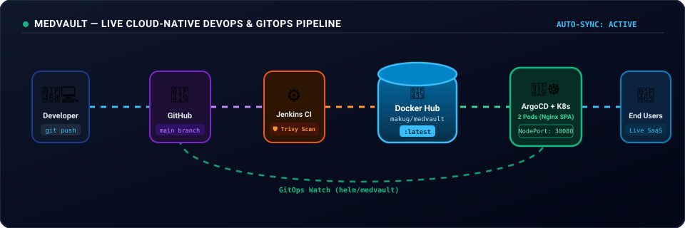

# 🏥 MedVault — Next-Gen Smart Healthcare SaaS & Cloud-Native DevOps Platform

[](https://react.dev/)
[](https://www.typescriptlang.org/)
[](https://vitejs.dev/)
[](https://hub.docker.com/r/makug/medvault)
[](https://kubernetes.io/)
[](https://helm.sh/)
[](https://www.jenkins.io/)
[](https://argo-cd.readthedocs.io/)
[](https://trivy.dev/)

> **Unified EMR, Multi-Portal Clinical Operations, OPD Queue Management, ABDM/FHIR Compliance, and Production-Grade DevOps & GitOps Automation.**

<div align="center">
  <br />
  
  <br />
</div>

---

## 📑 Table of Contents

- [🌟 1. Project Overview & Features](#-1-project-overview--features)
- [🏗️ 2. System Architecture](#️-2-system-architecture)
- [💻 3. Local Development (No Docker)](#-3-local-development-no-docker)
  - [Prerequisites & Node.js Installation](#prerequisites--nodejs-installation-on-linuxubuntu)
  - [Install & Run Dev Server](#install--run-dev-server)
- [🐳 4. Docker & Docker Compose](#-4-docker--docker-compose)
  - [Multi-Stage Dockerfile Explained](#multi-stage-dockerfile-explained)
  - [Nginx SPA Configuration](#nginx-spa-configuration)
  - [Docker Build & Run Commands](#docker-build--run-commands)
  - [Docker Compose Guide](#docker-compose-guide)
- [🚀 5. CI/CD Pipeline (Jenkins & GitHub Actions)](#-5-cicd-pipeline-jenkins--github-actions)
  - [Jenkins Pipeline (Jenkinsfile Breakdown)](#jenkins-pipeline-jenkinsfile-breakdown)
  - [Jenkins Credentials Setup](#jenkins-credentials-setup-step-by-step)
  - [Security Scanning with Aqua Trivy](#security-scanning-with-aqua-trivy)
- [☸️ 6. Kubernetes (K8s) Orchestration](#️-6-kubernetes-k8s-orchestration)
  - [Manifest Files Explained (`deployment`, `service`, `hpa`, `kustomization`)](#manifest-files-explained)
  - [Deploying on Kubernetes](#deploying-on-kubernetes)
  - [Accessing the Application](#accessing-the-application)
- [⎈ 7. Helm Package Management & Helm Dashboard](#-7-helm-package-management--helm-dashboard)
  - [Helm Installation Guide](#helm-installation-guide)
  - [Helm Chart Structure & `values.yaml`](#helm-chart-structure--valuesyaml)
  - [Deploy, Upgrade & Rollback Commands](#deploy-upgrade--rollback-commands)
  - [Helm Dashboard GUI (Komodor)](#helm-dashboard-gui-komodor)
- [🐙 8. GitOps with ArgoCD](#-8-gitops-with-argocd)
  - [What is GitOps?](#what-is-gitops)
  - [ArgoCD Installation in Kubernetes](#argocd-installation-in-kubernetes)
  - [Accessing ArgoCD UI & Admin Credentials](#accessing-argocd-ui--admin-credentials)
  - [Connecting MedVault (`application.yaml`)](#connecting-medvault-applicationyaml)
  - [The GitOps Magic: Automated Self-Healing & Drift Correction](#the-gitops-magic-automated-self-healing--drift-correction)
- [🛠️ 9. Troubleshooting & FAQs](#️-9-troubleshooting--faqs)

---

## 🌟 1. Project Overview & Features

**MedVault** is an enterprise-grade Healthcare SaaS solution built with **React 19, TypeScript, Vite, Tailwind CSS, and Zustand**. It addresses operational bottlenecks in hospitals while adhering to national digital health standards (**ABDM**, **ABHA**, and **FHIR v4.0.1**).

### 🩺 Key Healthcare Portals
1. **🩺 Doctor Studio**: Live OPD queue, digital prescription generator with doctor signatures, patient history, and diagnostic reports.
2. **🏥 Reception Desk**: Walk-in token generator, live queue manager routed to doctor studios, appointment scheduling.
3. **👨‍👩‍👧 Patient Portal**: 14-digit ABHA digital health card with QR verification, encrypted EMR vault with inline PDF reports, telehealth booking.
4. **💊 Pharmacy & Labs**: Real-time prescription fulfillment, medicine inventory catalog, lab test booking.
5. **⚙️ Admin Suite**: Hospital-wide analytics, staff and doctor onboarding, role-based access control (RBAC).

---

## 🏗️ 2. System Architecture

```text
                                  +-----------------------------+
                                  |   Developer (Local Work)    |
                                  +--------------+--------------+
                                                 |
                                         (git push main)
                                                 v
                                  +--------------+--------------+
                                  |    GitHub Repository        |
                                  | (mukeshchaudhary14/medvault)|
                                  +-------+--------------+------+
                                          |              |
                      +-------------------+              +-------------------+
                      | (Webhook Trigger)                                    | (GitOps Watch)
                      v                                                      v
    +-----------------+-------------------+                +-----------------+-------------------+
    |           Jenkins CI Pipeline       |                |         ArgoCD GitOps Engine        |
    | - Stage 1: Code Quality & Test      |                | - Watches: helm/medvault/           |
    | - Stage 2: Docker Multi-Stage Build |                | - Auto-Sync & Self-Heal Enabled     |
    | - Stage 3: Trivy Security Scan      |                +-----------------+-------------------+
    | - Stage 4: Push to Docker Hub       |                                  |
    +-----------------+-------------------+                                  | (Reconcile / Deploy)
                      |                                                      |
                 (docker push)                                               |
                      v                                                      v
    +-----------------+-------------------+                +-----------------+-------------------+
    |     Docker Hub Registry             | <--------------+       Kubernetes Cluster            |
    |    (makug/medvault:latest)          |  (Pull Image)  | - Service (NodePort: 30080)         |
    +-------------------------------------+                | - Deployment (2 HA Pods)            |
                                                           | - HPA (Autoscaler)                  |
                                                           +-----------------+-------------------+
                                                                             |
                                                                             v
                                                           +-----------------+-------------------+
                                                           |   End Users (Browser: :30080)       |
                                                           +-------------------------------------+
```

---

## 💻 3. Local Development (No Docker)

### Prerequisites & Node.js Installation on Linux/Ubuntu
React is a JavaScript library and requires **Node.js (v18+)** and **npm** installed on your system.

```bash
# Option A: Fastest via Ubuntu Apt
sudo apt update
sudo apt install -y nodejs npm

# Option B: Recommended via NVM (No permission issues)
curl -o- https://raw.githubusercontent.com/nvm-sh/nvm/v0.40.1/install.sh | bash
source ~/.bashrc
nvm install 22
```

Verify installation:
```bash
node -v    # Expected: v22.x or v20.x
npm -v     # Expected: 10.x
```

### Install & Run Dev Server
```bash
# 1. Clone or navigate into repository
cd ~/Downloads/medvault

# 2. Install dependencies (handles React 19 dependencies)
npm install --legacy-peer-deps

# 3. Start local development server
npm run dev
```

App will run at 👉 **`http://localhost:5173`**

---

## 🐳 4. Docker & Docker Compose

### Multi-Stage Dockerfile Explained
A standard Node.js image is over 1GB. Our [`Dockerfile`](Dockerfile) uses a **multi-stage build**:
* **Stage 1 (Build)**: Uses `node:22-alpine` to compile TypeScript and build the static assets via Vite.
* **Stage 2 (Serve)**: Uses ultra-lightweight `nginx:alpine` (~25MB) to serve the production bundle. Build tools are discarded, leaving only production static files.

### Nginx SPA Configuration
In React Single Page Applications (SPA), routing is handled in the browser. If a user refreshes `/doctor` or `/patient`, default Nginx throws a `404 Not Found`. 
Our [`nginx.conf`](nginx.conf) contains:
```nginx
location / {
    try_files $uri $uri/ /index.html;
}
```
This forces all requests to fall back to `index.html`, allowing React Router to handle page rendering seamlessly.

### Docker Build & Run Commands

```bash
# 1. Build Docker image with tag
docker build -t makug/medvault:latest .

# 2. Run container in detached mode (-d) mapping host port 5173 to container port 80
docker run -d -p 5173:80 --name medvault-app makug/medvault:latest

# 3. View live container logs
docker logs -f medvault-app

# 4. Stop and delete container
docker stop medvault-app && docker rm medvault-app
```

### Docker Compose Guide

* **Local Build & Run**:
  ```bash
  docker compose up --build -d
  ```

* **Production (Direct Pull from Docker Hub without building)**:
  Uses [`docker-compose.prod.yml`](docker-compose.prod.yml):
  ```bash
  docker compose -f docker-compose.prod.yml up -d
  ```

* **Stop services**:
  ```bash
  docker compose down
  ```

---

## 🚀 5. CI/CD Pipeline (Jenkins & GitHub Actions)

### Jenkins Pipeline (`Jenkinsfile` Breakdown)
The declarative [`Jenkinsfile`](Jenkinsfile) automates the full test, build, scan, and deploy cycle:

```groovy
pipeline {
    agent any
    environment {
        DOCKER_HUB_USER    = 'makug'
        DOCKER_IMAGE_NAME  = 'medvault'
        DOCKER_REPOSITORY  = "${DOCKER_HUB_USER}/${DOCKER_IMAGE_NAME}"
        IMAGE_TAG          = "${env.BUILD_NUMBER}"
        DOCKER_CREDENTIALS = 'dockerhub-credentials'
    }
    // Stages: Checkout -> Quality Test -> Docker Build -> Trivy Scan -> Push -> Deploy
}
```

1. **Stage 1: Checkout**: Pulls latest code from Git.
2. **Stage 2: Code Quality & Test**: Runs `npm run lint` and `npm run build`. If Node.js is not on the Jenkins host, it executes inside a disposable `node:22-alpine` container.
3. **Stage 3: Docker Build**: Tags image with immutable `BUILD_NUMBER` and `latest`.
4. **Stage 4: Security Scan (Trivy)**: Scans the container image for HIGH and CRITICAL vulnerabilities.
5. **Stage 5: Push to Docker Hub**: Securely logs in using Jenkins credentials and pushes tags to `makug/medvault`.
6. **Stage 6: Deploy**: Pulls the freshly built image directly from Docker Hub and restarts the container with zero dependency on local Git code.

### Jenkins Credentials Setup (Step-by-Step)
If you get `ERROR: Could not find credentials entry with ID 'dockerhub-credentials'`:
1. Open Jenkins Dashboard ➔ **Manage Jenkins** ➔ **Credentials** ➔ **System** ➔ **Global credentials (unrestricted)**.
2. Click **+ Add Credentials**.
3. Fill details:
   * **Kind**: `Username with password`
   * **Username**: `makug`
   * **Password**: *Your Docker Hub Personal Access Token or Password*
   * **ID**: `dockerhub-credentials` *(Must match exactly)*
4. Click **Create** and trigger **Build Now**.

### Security Scanning with Aqua Trivy
Trivy scans OS packages (Alpine) and node modules for known CVEs before the image is allowed into production:
```bash
docker run --rm -v /var/run/docker.sock:/var/run/docker.sock \
  aquasec/trivy:latest image --severity HIGH,CRITICAL makug/medvault:latest
```

---

## ☸️ 6. Kubernetes (K8s) Orchestration

All Kubernetes resource definitions are organized in the [`k8s/`](k8s/) directory:

### Manifest Files Explained

1. **[`k8s/deployment.yaml`](k8s/deployment.yaml)**:
   * **`replicas: 2`**: Runs 2 pods in parallel for high availability.
   * **`strategy: RollingUpdate`**: Guarantees zero downtime by creating new pods before terminating old ones.
   * **`resources`**: Requests 100m CPU / 128Mi RAM; limits to 500m CPU / 512Mi RAM.
   * **`livenessProbe` & `readinessProbe`**: Automatically restarts frozen pods and redirects traffic only when Nginx responds with HTTP 200.

2. **[`k8s/service.yaml`](k8s/service.yaml)**:
   * **`type: NodePort`**: Exposes the application outside the cluster.
   * Routes traffic from NodePort **`30080`** ➔ Service Port **`80`** ➔ Pod Container Port **`80`**.
   * Acts as a built-in Load Balancer across both pods.

3. **[`k8s/hpa.yaml`](k8s/hpa.yaml)**:
   * **Horizontal Pod Autoscaler**: Automatically scales pods between **2 and 5** when average CPU utilization exceeds **75%**.

4. **[`k8s/kustomization.yaml`](k8s/kustomization.yaml)**:
   * Bundles all resources together for single-command deployment and environment overlays.

### Deploying on Kubernetes

```bash
# Step 1: Create local cluster with kind (if not already running)
kind create cluster --name medvault-cluster

# Step 2: Apply all manifests using Kustomize (-k)
kubectl apply -k k8s/
# Or standard file apply: kubectl apply -f k8s/

# Step 3: Verify resources
kubectl get pods
kubectl get svc
kubectl get hpa
```

### Accessing the Application
```bash
# Port forward to localhost:8080
kubectl port-forward svc/medvault-service 8080:80
```
Open 👉 **`http://localhost:8080`**

---

## ⎈ 7. Helm Package Management & Helm Dashboard

### Helm Installation Guide
If Helm is not installed on your system:

```bash
# Method 1: Via Snap (Recommended on Ubuntu)
sudo snap install helm --classic

# Method 2: Via Official Script
curl https://raw.githubusercontent.com/helm/helm/main/scripts/get-helm-3 | bash

# Verify
helm version
```

### Helm Chart Structure & `values.yaml`
Instead of editing hardcoded YAML files, our chart in [`helm/medvault/`](helm/medvault/) is controlled by [`values.yaml`](helm/medvault/values.yaml):

```yaml
replicaCount: 2
image:
  repository: makug/medvault
  tag: "latest"
  pullPolicy: Always

service:
  type: NodePort
  port: 80
  targetPort: 80
  nodePort: 30080

resources:
  requests:
    cpu: 100m
    memory: 128Mi
  limits:
    cpu: 500m
    memory: 512Mi

autoscaling:
  enabled: false  # Disabled for local cluster without metrics-server
```

### Deploy, Upgrade & Rollback Commands

```bash
# 1. Install Helm Release
helm install medvault-release ./helm/medvault

# 2. Recommended Best Practice (Installs if missing, upgrades if present):
helm upgrade --install medvault-release ./helm/medvault

# 3. Check release status
helm list

# 4. On-the-fly upgrade (scale to 4 replicas without touching files)
helm upgrade medvault-release ./helm/medvault --set replicaCount=4

# 5. One-click Rollback to revision 1
helm rollback medvault-release 1

# 6. Complete Uninstall
helm uninstall medvault-release
```

### Helm Dashboard GUI (Komodor)
Helm Dashboard provides a visual web interface to inspect releases, compare revision diffs, and perform 1-click upgrades and rollbacks:

```bash
# 1. Install Helm Dashboard Plugin
helm plugin install --verify=false https://github.com/komodorio/helm-dashboard.git

# 2. Launch on port 8088 (Avoiding 8080 which is used by Jenkins)
helm dashboard --port 8088
```
Open 👉 **`http://localhost:8088`**

---

## 🐙 8. GitOps with ArgoCD

### What is GitOps?
In GitOps, **Git is the Single Source of Truth**. You never run manual `kubectl apply` commands in production. When you commit and push changes to GitHub, ArgoCD detects the change and automatically syncs it to the Kubernetes cluster.

### ArgoCD Installation in Kubernetes

```bash
# 1. Create argocd namespace
kubectl create namespace argocd

# 2. Install ArgoCD components
kubectl apply -n argocd -f https://raw.githubusercontent.com/argoproj/argo-cd/stable/manifests/install.yaml

# 3. Wait until server pod is running
kubectl wait --for=condition=ready pod -l app.kubernetes.io/name=argocd-server -n argocd --timeout=300s
```

### Accessing ArgoCD UI & Admin Credentials

```bash
# 1. Port forward to port 8085
kubectl port-forward svc/argocd-server -n argocd 8085:443
```
Open 👉 **`https://localhost:8085`**

```bash
# 2. Retrieve initial admin password
kubectl -n argocd get secret argocd-initial-admin-secret -o jsonpath="{.data.password}" | base64 -d; echo
```
* **Username**: `admin`
* **Password**: *(Output from command above)*

### Connecting MedVault (`application.yaml`)
Our [`argocd/application.yaml`](argocd/application.yaml) declaratively tells ArgoCD where to find the Helm chart and where to deploy it:

```bash
kubectl apply -f argocd/application.yaml
```

Verify status:
```bash
kubectl get applications -n argocd
# Output: medvault-app   Synced   Healthy
```

### The GitOps Magic: Automated Self-Healing & Drift Correction
1. In [`helm/medvault/values.yaml`](helm/medvault/values.yaml), change `replicaCount: 3`.
2. Commit and push:
   ```bash
   git add helm/medvault/values.yaml
   git commit -m "scale: increase replicas to 3"
   git push origin main
   ```
3. Watch the ArgoCD UI: A 3rd Pod will be created automatically within seconds without running any `kubectl` commands!

---

## 🛠️ 9. Troubleshooting & FAQs

### Q1: `nodePort 30080: provided port is already allocated`
* **Cause**: An existing service has already claimed port 30080.
* **Fix**: Delete the older service before deploying the new release:
  ```bash
  kubectl delete svc medvault-service --ignore-not-found
  helm uninstall medvault-release 2>/dev/null || true
  ```

### Q2: Port 8080 collision with Jenkins
* **Cause**: Jenkins runs on port 8080 by default, conflicting with Helm Dashboard or port-forwarding.
* **Fix**: Use alternative ports:
  * Helm Dashboard: `helm dashboard --port 8088`
  * ArgoCD: `kubectl port-forward svc/argocd-server -n argocd 8085:443`
  * App: `kubectl port-forward svc/medvault-service 8081:80`

### Q3: ArgoCD Application Status is `Degraded` due to HPA
* **Cause**: Local clusters (Kind/Minikube) do not have `metrics-server` installed, so HPA cannot read CPU metrics.
* **Fix**: In [`helm/medvault/values.yaml`](helm/medvault/values.yaml), set `autoscaling.enabled: false`, commit, and push.

### Q4: Git push rejected `[rejected] main -> main (fetch first)`
* **Cause**: Remote repository on GitHub was initialized with files (like README) not present locally.
* **Fix**: Force push to overwrite initial template:
  ```bash
  git push origin main --force
  ```

---

## 📜 License
This project is open-source and available under the [MIT License](LICENSE).
